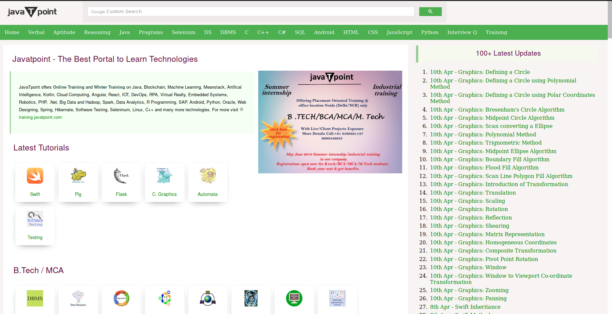
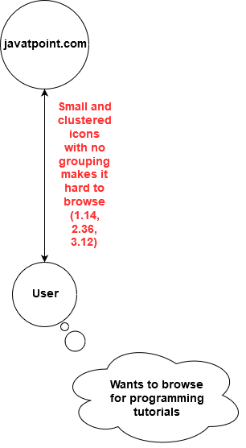

# final-project-team-kyoukai
final-project-team-kyoukai created by GitHub Classroom

Subject: [javatpoint.com](javatpoint.com)
### System Description
A website mainly designed for tutorials from many langugages, from older languages all the way to newer ones. There are also many topics that covers programming in general, such as Computer Graphics, Java Interview Questions, and Computer Science. The amount of tutorials supported by this website make it an important resource that many programmer, especially beginners, to try and take a look.

First Impression:
  1. The homepage is bulky
  2. Overwhelming informations
  3. No internal search bar

## Transcripts
Instructions:
- Search for a certain languge tutorial (Each user may be different)
- Search for another language tutorial (Each user may be different)
- Search for a certain topic in a certain language tutorial (Each user may be different)

For transcripts please refer to this page: [Transcripts](https://github.com/hci-a-if-its-2019/final-project-team-kyoukai/tree/master/Transcripts)

## Transcript 1 Artifacts

## Transcript 2 Artifacts

## Transcript 3 Artifacts

## Flow Model

## Cultural Model

## Sketch
### Sketch 1

## Prototype
For prototype please download and open the page on the browser.
[Prototype](https://github.com/hci-a-if-its-2019/final-project-team-kyoukai/tree/master/Prototype.html)
